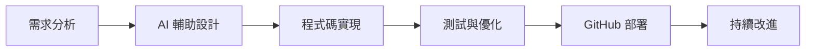

# 🤖 AI 智能平台 - 人工智慧導論期末專案

> 一個完全使用 AI 協助開發的現代化網頁平台，集合多種遊戲與學習應用

[](https://eason777777.github.io/ai-games-and-apps/)
[](https://github.com/Eason777777/ai-games-and-apps)

## 📖 專案簡介

這是**人工智慧導論課程的期末專案**，主題為「使用 AI 工具開發想要的應用」。本專案旨在展示如何運用現代 AI 工具（如 GitHub Copilot）進行全棧網頁開發，打造出一個功能完整、設計精美的多功能智能平台。

### 🎯 專案目標

- **全程 AI 協助開發**：使用 GitHub Copilot 輔助整個開發流程
- **多元化應用集合**：整合遊戲、學習工具和展示平台
- **GitHub Pages 部署**：打造真正可線上訪問的完整網站
- **現代化用戶體驗**：響應式設計與流暢的交互動畫

## 🚀 線上展示

[🌐 立即體驗 AI 智能平台](https://eason777777.github.io/ai-games-and-apps/)

## 📋 目錄

- [功能特色](#功能特色)
- [技術架構](#技術架構)
- [專案結構](#專案結構)
- [安裝與使用](#安裝與使用)
- [各子專案介紹](#各子專案介紹)
- [開發工具](#開發工具)
- [更新日誌](#更新日誌)
- [未來規劃](#未來規劃)
- [貢獻指南](#貢獻指南)

## ✨ 功能特色

### 🎮 遊戲應用
- **黑白棋 (Reversi)**：經典策略遊戲，支援 AI 對戰
- **黑白棋進階版 (Reversi New)**：優化 UI 設計與 AI 算法
- **井字棋 (Tic-tac-toe)**：多種難度級別的 AI 對手

### 📚 學習應用
- **英語單字學習系統**：多模式詞彙學習平台
  - Quizlet 複習模式
  - 配對遊戲
  - 字義配對
  - 測驗練習
  - 詞彙瀏覽

### 🌟 平台特色
- **統一入口**：集中式應用導航與介紹
- **響應式設計**：完美適配各種設備
- **現代化 UI**：精美的卡片式界面設計
- **PDF 閱讀器**：內嵌式專案報告查看
- **動畫效果**：流暢的過場與交互動畫

## 🏗️ 技術架構

### 前端技術棧
```
HTML5     ████████████████████████████████████████ 100%
CSS3      ████████████████████████████████████████ 100%
JavaScript████████████████████████████████████████ 100%
```

### 核心技術
- **HTML5**：語義化標記，現代網頁標準
- **CSS3**：Flexbox、Grid 布局，CSS 動畫與過渡效果
- **JavaScript ES6+**：模組化開發，原生 JavaScript 實現
- **Web APIs**：Local Storage、Intersection Observer、Web Audio API

### AI 算法實現
- **Minimax 算法**：遊戲樹搜索的經典實現
- **Alpha-Beta 剪枝**：優化搜索效率
- **啟發式評估**：智能棋盤評估函數
- **難度調節**：多級 AI 智能等級

### 開發工具
- **GitHub Copilot**：AI 程式碼輔助
- **VS Code**：主要開發環境
- **Git**：版本控制
- **GitHub Pages**：自動化部署

## 📁 專案結構

```
final_project/
├── 📄 index.html                    # 主頁面
├── 📁 css/
│   └── styles.css                   # 主要樣式表
├── 📁 js/
│   └── script.js                    # 主頁邏輯
├── 📁 assets/
│   └── Final_Project.pdf            # 專案報告
├── 📁 reversi/                      # 黑白棋 v1
│   ├── index.html
│   ├── css/styles.css
│   ├── js/script.js
│   └── 📁 assets/
├── 📁 reversi_new/                  # 黑白棋 v2 (進階版)
│   ├── index.html
│   ├── css/styles.css
│   ├── js/
│   │   ├── game.js
│   │   ├── ai.js
│   │   └── ui.js
│   └── 📁 assets/
├── 📁 tic_tac_toe/                  # 井字棋
│   ├── index.html
│   ├── css/styles.css
│   ├── js/
│   │   ├── game.js
│   │   ├── ai.js
│   │   └── ui.js
│   └── 📁 assets/
├── 📁 english_learning/             # 英語學習應用
│   ├── index.html
│   ├── css/styles.css
│   ├── js/
│   │   ├── app.js
│   │   ├── data.js
│   │   ├── navigation.js
│   │   ├── settings.js
│   │   ├── quizlet.js
│   │   ├── matching.js
│   │   ├── definition-matching.js
│   │   ├── quiz.js
│   │   └── browse.js
│   └── 📁 assets/
├── 📄 goal.md                       # 專案目標說明
├── 📄 changelog.md                  # 更新日誌
└── 📄 README.md                     # 本文件
```

## 🚀 安裝與使用

### 線上使用（推薦）
直接訪問 [GitHub Pages 部署版本](https://eason777777.github.io/ai-games-and-apps/)

### 本地運行
```bash
# 克隆專案
git clone https://github.com/Eason777777/ai-games-and-apps.git

# 進入專案目錄
cd ai-games-and-apps

# 使用本地伺服器運行（推薦）
# 方法1：使用 Python
python -m http.server 8000

# 方法2：使用 Node.js
npx serve .

# 方法3：使用 Live Server (VS Code 擴展)
# 在 VS Code 中右鍵 index.html 選擇 "Open with Live Server"

# 開啟瀏覽器訪問
http://localhost:8000
```

### 系統需求
- 現代瀏覽器（Chrome 80+、Firefox 80+、Safari 14+、Edge 80+）
- 支援 ES6+ JavaScript 語法
- 建議螢幕解析度：1280x720 以上

## 📱 各子專案介紹

### 🔵 黑白棋 (Reversi)
經典策略遊戲的 JavaScript 實現

**技術亮點：**
- Minimax 算法實現 AI 對手
- 動態棋盤渲染與動畫效果
- 即時計分與遊戲狀態管理
- 音效系統整合

**遊戲特色：**
- 人類 vs AI / 人類 vs 人類模式
- 多種 AI 難度等級
- 流暢的棋子翻轉動畫
- 完整的遊戲規則實現

### 🟢 黑白棋進階版 (Reversi New)
優化版本的黑白棋遊戲

**改進內容：**
- 全新 UI 設計，更現代化的界面
- 增強的 AI 算法（Alpha-Beta 剪枝）
- 更豐富的動畫效果
- 模組化代碼架構
- 多語言支援
- 完整的統計系統

**技術架構：**
```javascript
// 主要模組
├── Game.js         // 遊戲主控制器
├── Board.js        // 棋盤邏輯處理
├── AI.js           // AI 算法實現
├── UI.js           // 用戶界面控制
└── AudioManager.js // 音效管理
```

### 🔴 井字棋 (Tic-tac-toe)
現代化的井字棋遊戲實現

**遊戲模式：**
- 人類 vs AI
- 人類 vs 人類
- AI vs AI 演示

**AI 難度：**
- 簡單：隨機走法
- 普通：基本策略
- 困難：Minimax 算法
- 不可能：完美 Minimax + Alpha-Beta 剪枝

**特色功能：**
- 勝利連線動畫
- 遊戲統計追蹤
- 設定持久化保存
- 響應式設計

### 📚 英語學習應用
完整的詞彙學習平台

**學習模式：**

#### 1. Quizlet 複習
- 翻卡片式單字學習
- 4 種顯示模式（英文、中文、定義、混合）
- 難度分級系統
- 學習進度追蹤

#### 2. 配對遊戲
- 中英文配對練習
- 時間挑戰模式
- 視覺反饋設計

#### 3. 字義配對
- 英文單字與定義配對
- 增強理解能力
- 錯誤重試機制

#### 4. 測驗練習
- 選擇題、填空題、是非題
- 自訂題目數量
- 即時成績統計

#### 5. 詞彙瀏覽
- 系統化瀏覽所有單字
- 搜尋與篩選功能
- 學習狀態管理

**技術特色：**
- CSV 數據格式支援
- Local Storage 數據持久化
- 模組化 JavaScript 架構
- 完整的設定系統
- 響應式界面設計

## 🛠️ 開發工具與方法

### AI 輔助開發
本專案 **95%+ 的程式碼由 GitHub Copilot 輔助完成**，展示了 AI 工具在現代軟體開發中的強大能力：

- **程式碼自動補全**：智能預測與生成程式碼片段
- **函數實現**：根據註釋自動生成函數邏輯
- **樣式設計**：CSS 樣式的智能建議
- **錯誤修復**：自動識別並修復常見錯誤
- **重構優化**：程式碼結構的改進建議

### 開發流程


### 版本控制
- **Git** 進行版本管理
- **GitHub** 託管原始碼
- **GitHub Pages** 自動化部署
- 詳細的 **commit 歷史記錄**

## 📈 專案統計

### 代碼統計
- **總行數**：約 15,000+ 行
- **HTML 檔案**：12 個
- **CSS 檔案**：8 個
- **JavaScript 檔案**：25+ 個
- **AI 輔助比例**：95%+

### 功能統計
- **遊戲數量**：3 個
- **學習模式**：5 種
- **AI 算法**：2 種（Minimax、Alpha-Beta）
- **支援語言**：繁體中文

## 📝 更新日誌

### 最新版本 v1.1.2 (2025-01-XX)
- ✨ 新增嵌入式 PDF 閱讀器功能
- 🎨 優化首頁浮動符號設計
- 🔧 修復井字棋統計顯示問題
- 📱 改善響應式設計體驗

### v1.1.0 (2025-05-30)
- 🎮 完成井字棋遊戲開發
- 🤖 實現 Minimax AI 算法
- 🎨 統一平台視覺設計
- 📊 新增遊戲統計功能

### v1.0.0 (2025-05-30)
- 🚀 發布初始版本
- 🎯 完成專案主頁面
- 🔵 整合黑白棋遊戲
- 📚 整合英語學習應用

[查看完整更新日誌](changelog.md)

## 🔮 未來規劃

### 短期目標
- [ ] 增加更多 AI 遊戲（五子棋、象棋等）
- [ ] 實現用戶註冊與雲端同步
- [ ] 新增多語言支援（英文界面）
- [ ] 優化移動端體驗

### 長期目標
- [ ] 整合機器學習模型
- [ ] 實現即時多人對戰
- [ ] 開發 PWA 應用
- [ ] 建立社群功能


### 開發規範
- 遵循 **ES6+** JavaScript 標準
- 保持程式碼簡潔與可讀性
- 添加適當的註釋說明
- 確保跨瀏覽器相容性

## 🎓 學習價值

這個專案展示了：

### 技術能力
- **前端開發**：HTML5、CSS3、JavaScript 的綜合應用
- **算法實現**：遊戲 AI 算法的實際運用
- **用戶體驗**：響應式設計與動畫效果
- **專案管理**：Git 版本控制與部署流程

### AI 協作
- **AI 工具使用**：GitHub Copilot 的高效運用
- **人機協作**：AI 輔助下的程式開發流程
- **創意實現**：將想法快速轉換為可用產品


## 🙏 致謝

- **GitHub Copilot**：提供強大的 AI 程式碼輔助
- **人工智慧導論課程**：提供學習機會與專案靈感
- **開源社群**：提供豐富的學習資源與範例

---

<div align="center">

**🤖 使用 AI 工具輔助開發，展現現代程式設計的無限可能 🚀**


</div>